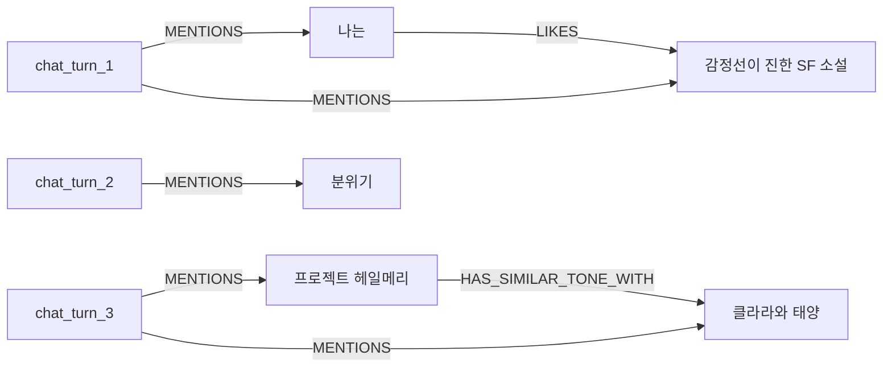

# KG Visualization

현재 `turn_03.json` 기준 전체 그래프 스냅샷입니다.

## Reading Guide

- `Episodic` 노드: `chat_turn_1`, `chat_turn_2`, `chat_turn_3`
- `MENTIONS`: 해당 턴에서 어떤 엔티티가 언급되었는지
- `RELATES_TO`: Graphiti가 추출한 구조화된 사실 관계

## Current Snapshot

- Episodes: 3
- Mention edges: 5
- Entity relation edges: 2
